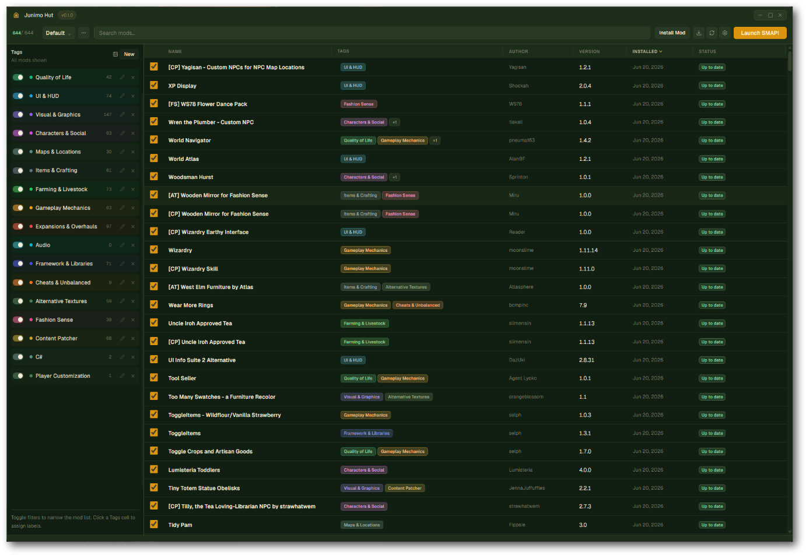
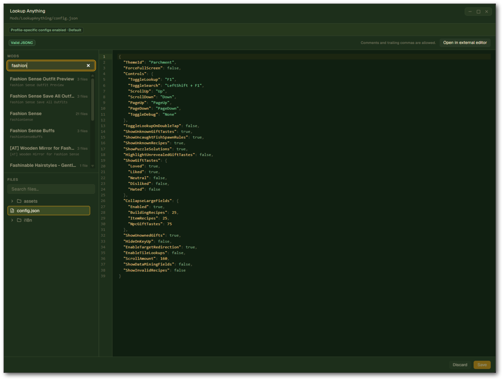

# Junimo Hut

Cross-platform mod manager for [Stardew Valley](https://www.stardewvalley.net/), built with **Go**, **Wails v3**, **Svelte 5**, and **Skeleton UI**.

## Features

- Mod discovery, enable/disable (non-destructive via symlink assembly + SMAPI `--mods-path`)
- Install mods from `.zip`, `.7z`, `.rar` (drag-and-drop or file picker)
- Unlimited profiles with per-profile mod loadouts
- Profile-specific `config.json` support
- Integrated config/json editor
- SMAPI launch, version display, update detection
- Mod update checking (SMAPI API, 1/hour rate limit)
- **Nexus mod bundles** — multi-part mods (CP + C# DLL, etc.) collapse into one expandable row when they share a Nexus ID
- **User-defined categories** with show/hide visibility filters
- Nexus Mods API (endorse, downloads, premium update install)
- i18n-ready translation API

## Preview





## Prerequisites

- Go 1.22+
- Node.js 20+
- [Wails v3 CLI](https://v3.wails.io/): `go install github.com/wailsapp/wails/v3/cmd/wails3@latest`

## Development

```bash
# Install frontend dependencies
cd frontend && npm install && cd ..

# Generate TypeScript bindings (after changing Go API)
wails3 generate bindings

# Run in dev mode (hot reload)
wails3 dev -config ./build/config.yml

# Or via Task
task dev
```

## Build

```bash
wails3 build
# or
task build
```

## CLI

- `--start-smapi` — Launch SMAPI automatically after the mod manager opens (useful for Steam launch options).

## Data locations

| Mode     | Windows                                                            | Linux                       | macOS                                      |
| -------- | ------------------------------------------------------------------ | --------------------------- | ------------------------------------------ |
| Default  | `%AppData%\JunimoHut\`                                             | `~/.local/share/JunimoHut/` | `~/Library/Application Support/JunimoHut/` |
| Portable | `{exe folder}\data\` (create empty `portable.txt` next to the exe) | same                        | same                                       |

**Dev note:** If `portable.txt` exists next to `bin\*.exe`, data lives under `bin\data\` instead of AppData. Rebuilds that clean `bin\` will wipe that copy — remove `portable.txt` from `bin\` if you want dev builds to use AppData like a normal install.

Files stored under the data directory: `config.json`, `categories.json`, `profiles/`, `mod-library/`, `downloads/`.

## Steam integration

Add to Stardew Valley launch options (Windows):

```bash
"FULL_PATH_TO\junimohut.exe" --start-smapi %command%
```

## License

MIT
